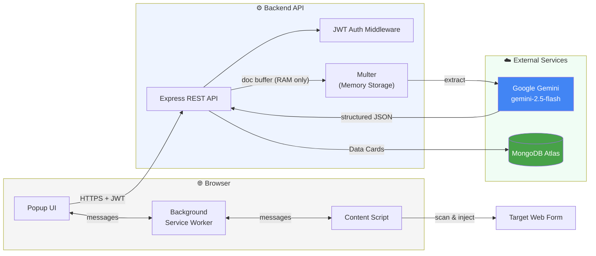
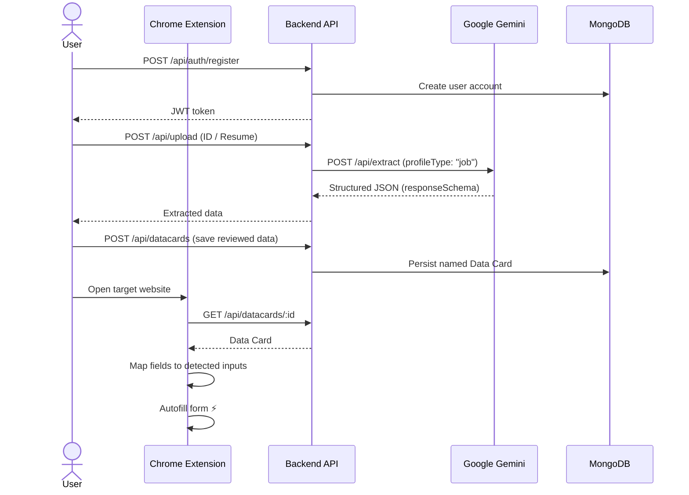
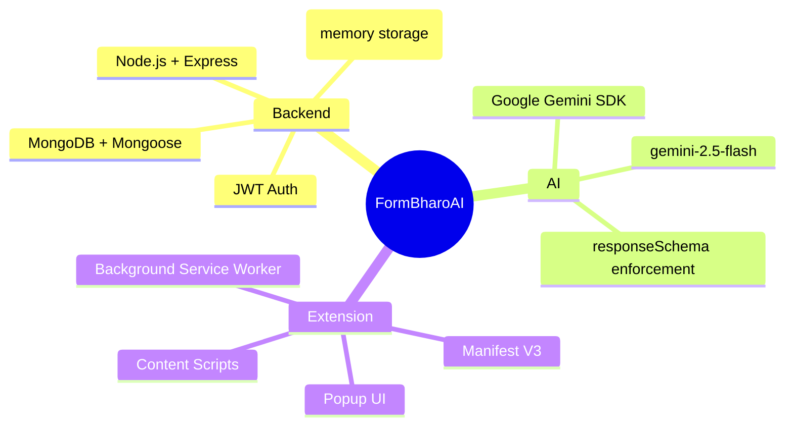

<div align="center">

# 📋 FormBharoAI

**Multi-profile form automation, powered by AI extraction and one-click autofill.**

FormBharoAI bridges your personal **Data Cards** and the web — using **Google Gemini** to extract structured data from documents, and a **Chrome Extension** to autofill forms in seconds.

[](https://nodejs.org/)
[](https://www.mongodb.com/cloud/atlas)
[](https://aistudio.google.com/app/apikey)
[](https://developer.chrome.com/docs/extensions/mv3/intro/)
[]()

</div>

---

## 📑 Table of Contents

- [Architecture & Concepts](#️-architecture--concepts)
- [System Diagram](#-system-diagram)
- [The Multi-Profile Pipeline](#-the-multi-profile-pipeline)
- [Setup Guide](#️-setup-guide)
- [Tech Stack](#-tech-stack)

---

## 🏗️ Architecture & Concepts

This project has evolved into a robust **SaaS architecture**, separating data management from the browser-extension execution layer.

### 1. Backend API (`/backend`)

| Concern | Implementation |
|---|---|
| **Database** | **MongoDB** (via Mongoose) — permanently stores user accounts and multi-profile Data Cards (e.g. Job Profiles, Government Exam Profiles) |
| **Authentication** | **JWT** — users can only access and modify their own Data Cards |
| **AI Integration** | **Google Gemini SDK** (`@google/genai`), using `gemini-2.5-flash` with dynamic JSON Schema enforcement (`responseSchema`) to guarantee structured extraction based on the *type* of profile requested |
| **Privacy-First Extraction** | `multer.memoryStorage()` — document buffers stay in RAM, are never written to disk, and are deleted from session memory the moment extraction completes |

### 2. Chrome Extension (`/extension`)

| Component | Role |
|---|---|
| **Manifest V3** | Modern Chrome extension standard |
| **Content Scripts** | Run in the page context to scan DOM inputs and inject mapped values |
| **Background Service Worker** | Message broker — proxies requests securely between Popup and Content Script |
| **Popup** | UI for authentication, Data Card selection, field mapping, and triggering autofill |

---

## 🧭 System Diagram



---

## 🚀 The Multi-Profile Pipeline



| Step | Action | Endpoint |
|---|---|---|
| 1️⃣ | **Onboarding** — user registers an account | `POST /api/auth/register` |
| 2️⃣ | **Document Upload** — user uploads an ID or Resume | `POST /api/upload` |
| 3️⃣ | **Smart Extraction** — Gemini extracts data for a given context | `POST /api/extract` (`profileType: 'job'`) |
| 4️⃣ | **Save Data Card** — reviewed data saved permanently to the account | `POST /api/datacards` |
| 5️⃣ | **Autofill** — extension fetches the Data Card, maps fields, injects values | `GET /api/datacards/:id` |

---

## 🛠️ Setup Guide

### Prerequisites

- Node.js (v18+)
- A Google Gemini API Key → [Get one here](https://aistudio.google.com/app/apikey)
- A MongoDB database (Local or [MongoDB Atlas](https://www.mongodb.com/cloud/atlas))

### 1. Backend Setup

```bash
# 1. Navigate to the backend directory
cd backend

# 2. Install dependencies
npm install

# 3. Create your .env file
cp .env.example .env
```

Configure your `.env`:

| Variable | Description |
|---|---|
| `GEMINI_API_KEY` | Your Gemini API key |
| `MONGODB_URI` | Your MongoDB connection string, e.g. `mongodb+srv://<user>:<password>@cluster0.mongodb.net/formbharo` |
| `JWT_SECRET` | A long, random string used to sign auth tokens |

```bash
# 4. Start the server
npm run dev   # or: npm start
```

### 2. Chrome Extension Setup

1. Open Chrome and navigate to `chrome://extensions/`
2. Enable **Developer mode** (top right)
3. Click **Load unpacked**
4. Select the `extension/` folder from this project
5. *(Optional, for strict security)* Copy the extension's **ID** and add it to your backend `.env`:
```bash
   EXTENSION_ORIGIN=chrome-extension://<YOUR_EXTENSION_ID>
```

---

## 🧰 Tech Stack



</div>
